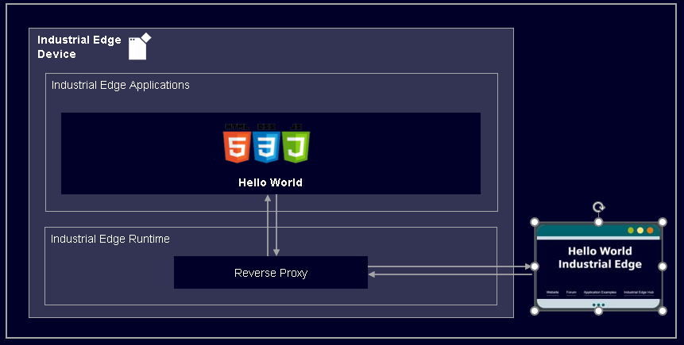
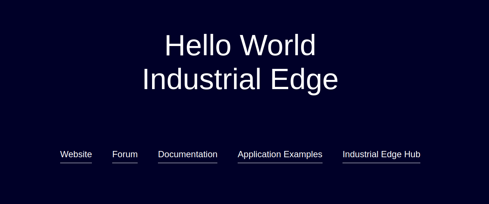

# Hello World Industrial Edge

This is a Hello World application for Industrial Edge. 

- [Hello World Industrial Edge](#hello-world-industrial-edge)
  - [Description](#description)
    - [Overview](#overview)
  - [Requirements](#requirements)
    - [Used components](#used-components)
    - [Helpful tools](#helpful-tools)
  - [Installation](#installation)
  - [Usage](#usage)
  - [Documentation](#documentation)
  - [Contribution](#contribution)
  - [License and Legal Information](#license-and-legal-information)
  - [Disclaimer](#disclaimer)

## Description

### Overview

This application is Hello World Webserver Application for Industrial Edge.

## Requirements

### Used components

- OS: Windows or Linux
- Docker minimum V18.09
- Docker Compose V2.4
- Industrial Edge App Publisher (IEAP) V1.1.5
- Industrial Edge Management (IEM) V1.1.16
- Industrial Edge Device (IED) V1.1.0-44

### Helpful tools
- Any development environment (e.g. Visual Studio Code, Eclipse, …)
- Docker Extension for your development environment e.g. Visual Studio Code Extension 

## Installation

You can find the further information about the following steps in the [docs](./docs/installation.md).

- [Build application](docs/installation.md#build-application)
- [Upload application to Industrial Edge Management](docs/installation.md#upload-app-to-the-industrial-edge-management)
- [Install application to Industrial Edge Device](docs/installation.md#install-application-on-industrial-edge-device)

## Usage

Login to Industrial Edge Device and click on Icon of the Hello-World Application to open page in Browser.

## Documentation
 
- You can find further documentation and help in the following links
  - [Industrial Edge Hub](https://iehub.eu1.edge.siemens.cloud/#/documentation)
  - [Industrial Edge Forum](https://www.siemens.com/industrial-edge-forum)
  - [Industrial Edge landing page](https://new.siemens.com/global/en/products/automation/topic-areas/industrial-edge/simatic-edge.html)
  - [Industrial Edge GitHub page](https://github.com/industrial-edge)
  
## Contribution

Thank you for your interest in contributing. Anybody is free to report bugs, unclear documentation, and other problems regarding this repository in the Issues section.
Additionally everybody is free to propose any changes to this repository using Pull Requests.

If you are interested in contributing via Pull Request, please check the [Contribution License Agreement](Siemens_CLA_1.1.pdf) and forward a signed copy to [industrialedge.industry@siemens.com](mailto:industrialedge.industry@siemens.com?subject=CLA%20Agreement%20Industrial-Edge).

## License and Legal Information

Please read the [Legal information](LICENSE.txt).

## Disclaimer

IMPORTANT - PLEASE READ CAREFULLY:

This documentation describes how you can download and set up containers which consist of or contain third-party software. By following this documentation you agree that using such third-party software is done at your own discretion and risk. No advice or information, whether oral or written, obtained by you from us or from this documentation shall create any warranty for the third-party software. Additionally, by following these descriptions or using the contents of this documentation, you agree that you are responsible for complying with all third party licenses applicable to such third-party software. All product names, logos, and brands are property of their respective owners. All third-party company, product and service names used in this documentation are for identification purposes only. Use of these names, logos, and brands does not imply endorsement.