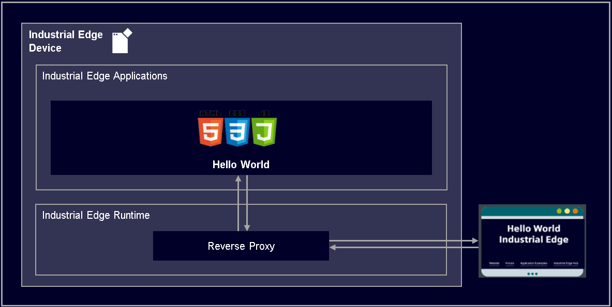

# Hello World Industrial Edge

This is a Hello World application for Industrial Edge. 

- [Hello World Industrial Edge](#hello-world-industrial-edge)
  - [Description](#description)
    - [Overview](#overview)
  - [Requirements](#requirements)
    - [Used components](#used-components)
    - [Helpful tools](#helpful-tools)
  - [Installation](#installation)
  - [Usage](#usage)
  - [Documentation](#documentation)
  - [Contribution](#contribution)
  - [Licence and Legal Information](#licence-and-legal-information)

## Description

### Overview

This application is Hello World Webserver Application for Industrial Edge.

## Requirements

### Used components

- OS: Windows or Linux
- Docker minimum V18.09
- Docker Compose V2.4
- Industrial Edge App Publisher (IEAP) V1.1.14
- Industrial Edge Management (IEM) V1.1.11
- Industrial Edge Device (IED) V1.1.0-44

### Helpful tools
- Any development environment (e.g. Visual Studio Code, Eclipse, …)
- Docker Extension for your development environment e.g. Visual Studio Code Extension 

## Installation

You can find the further information about the following steps in the [docs](./docs).

- [Build application](docs/installation.md#build-application)
- [Upload application to Industrial Edge Management](docs/installation.md#upload-app-to-the-industrial-edge-management)
- [Install application to Industrial Edge Device](docs/installation.md#install-application-on-industrial-edge-device)

## Usage

Login to Industrial Edge Device and click on Icon of the Hello-World Application to open page in Browser.

## Documentation
 
- Here is a link to the [docs](docs/) of this application example.
- You can find further documentation and help in the following links
  - [Industrial Edge Hub](https://iehub.eu1.edge.siemens.cloud/#/documentation)
  - [Industrial Edge Forum](https://www.siemens.com/industrial-edge-forum)
  - [Industrial Edge landing page](https://new.siemens.com/global/en/products/automation/topic-areas/industrial-edge/simatic-edge.html)
  - [Industrial Edge GitHub page](https://github.com/industrial-edge)
  
## Contribution

Thanks for your interest in contributing. Anybody is free to report bugs, unclear documentation, and other problems regarding this repository in the Issues section or, even better, is free to propose any changes to this repository using Merge Requests.

## Licence and Legal Information

Please read the [Legal information](LICENSE.md).
