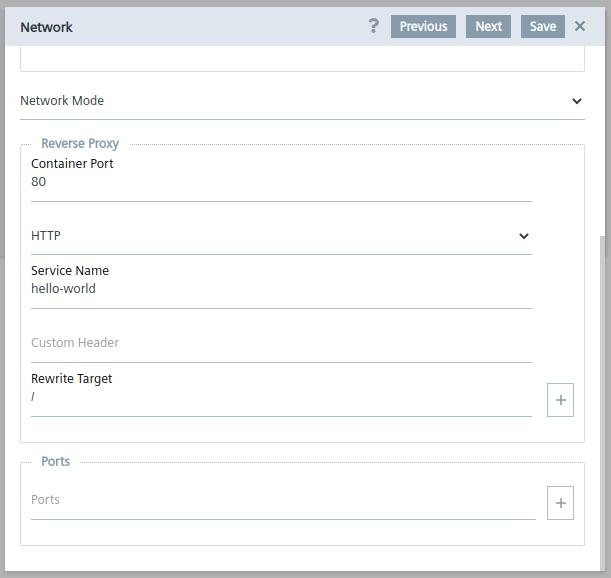

# Implementation

- [Implementation](#implementation)
  - [Introduction](#introduction)
  - [HTML `\<base>` Tag](#html-base-tag)
  - [Reverse Proxy](#reverse-proxy)

## Introduction

When running your web application in your development environment usually your app is served from the root directory as instead on Industrial Edge your application is deployed behind a reverse proxy and the content is not provided from the root but from a subpath.  
How you can achieve that your application can handle both scenarios without much effort is part of this document.

## HTML `\<base>` Tag

The `\<base>` HTML tag specifies the base URL to use for all relative URLs in the document. This is relevant as CSS and JavaScript files are referenced using relative URLs. If the `\<base>` tag is not specified correctly these files are not loaded and your web application does not function as indented.

For more information please refer to [Mozilla HTML documentation](https://developer.mozilla.org/en-US/docs/Web/HTML/Element/base)

The easiest way for that your application is able to handle being served from different URLs is to define the base URL as a relative URL.

```html
<base href="./">
```

By doing that your application is able to load CSS and JavaScript and other content no matter the index.html is served from the root or from a subpath.

## Reverse Proxy

In the Industrial Edge App Publisher the user has to add a configuration to use the reverse proxy of the Industrial Edge Device. 

```txt
  Container Port: 80
  Protocol: HTTP 
  Service Name: hello-world
  Rewrite Target: /
```

<a href="graphics/reverse-proxy.png"></a>

This example shows that the web application will be served using the subpath `hello-world`.
