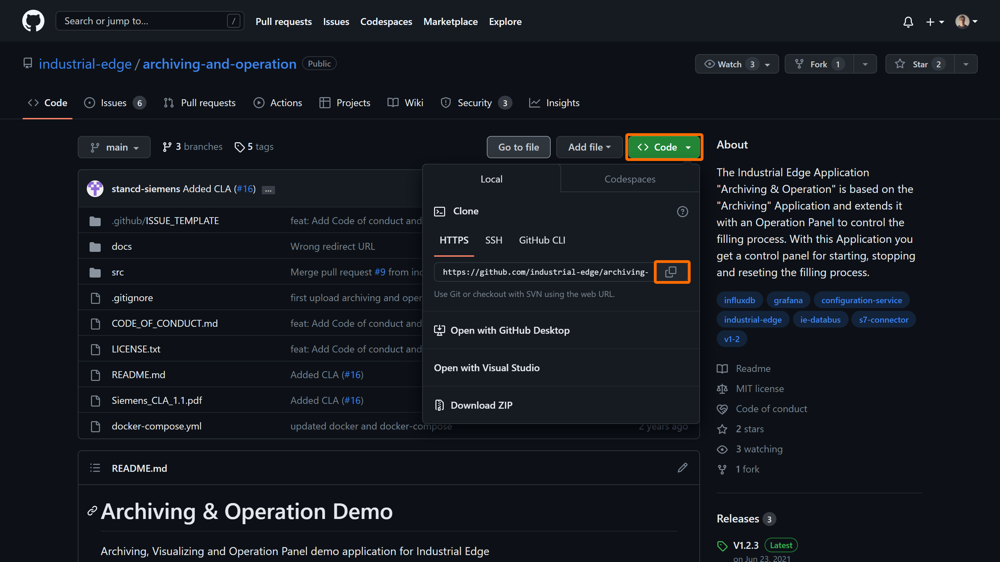
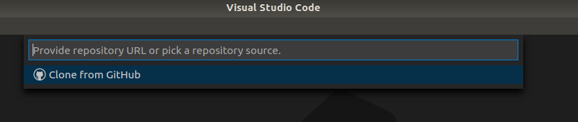
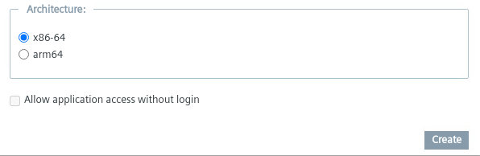

# Installation

- [Installation](#installation)
  - [Build Application](#build-application)
    - [Download Repository](#download-repository)
    - [Build docker image](#build-docker-image)
      - [Building the image for x86 based devices](#building-the-image-for-x86-based-devices)
      - [Building the image for ARM based devices](#building-the-image-for-arm-based-devices)
  - [Upload App to the Industrial Edge Management](#upload-app-to-the-industrial-edge-management)
    - [Connect your Industrial Edge App Publisher](#connect-your-industrial-edge-app-publisher)
    - [Upload App using the Industrial Edge App Publisher](#upload-app-using-the-industrial-edge-app-publisher)
  - [Install Application on Industrial Edge Device](#install-application-on-industrial-edge-device)
  - [Usage](#usage)
  
## Build Application

### Download Repository

Download or clone the repository source code to your workstation.  


- Through terminal:
  
  ```bash
  git clone https://github.com/industrial-edge/hello-world.git
  ```

- Through VSCode:  
<kbd>CTRL</kbd>+<kbd>&uarr; SHIFT</kbd>+<kbd>P</kbd> or <kbd>F1</kbd> to open VSCode's command pallette and type `git clone`:

  

### Build docker image

- Navigate into `src` and find the file named `Dockerfile.example`. The `Dockerfile.example` is an example Dockerfile that can be used to build the docker image(s) of the service(s) that runs in this application example. If you choose to use these, rename the file to `Dockerfile` before proceeding
- Open a console in the root folder (where the `docker-compose.yml` file is)

#### Building the image for x86 based devices

- Use the `docker compose build` (replaces the older `docker-compose build`) command to build the docker image of the service which is specified in the docker-compose.yml file.
- These Docker images can now be used to build your app with the Industrial Edge App Publisher
- `docker inspect " Image name"` can be used to check for the image

#### Building the image for ARM based devices

To create a Docker image that runs on ARM-based devices, the building process has to be carried out on a development environment that supports the ARM architecture. This support can be provided by using an emulator if your development environment is not ARM-based.

The following Docker command can be used to run the emulator. More information can be found [here](https://docs.docker.com/build/building/multi-platform/#building-multi-platform-images) (**Note: The container will run in privileged mode; if this is undesired, feel free to use an alternative method**)

```bash
sudo docker run --privileged --rm tonistiigi/binfmt -- install arm64
```

Afterwards, you can proceed with the following:

- Define the platform in the docker-compose file, simply uncomment the line mentioning the platform in the docker-compose file
- Use the `docker compose build` (replaces the older `docker-compose build`) command to build the docker image of the service which is specified in the docker-compose.yml file.
- These Docker images can now be used to build your app with the Industrial Edge App Publisher
- `docker inspect " Image name"` can be used to check for the image

## Upload App to the Industrial Edge Management

Please find below a short description how to publish your application in your IEM.

For more detailed information please see the section for [uploading apps to the IEM](https://github.com/industrial-edge/upload-app-to-iem).

### Connect your Industrial Edge App Publisher

- Connect your Industrial Edge App Publisher to your docker engine
- Connect your Industrial Edge App Publisher to your Industrial Edge Management System

### Upload App using the Industrial Edge App Publisher

- Create a new App Project or select a existing one
- Create new application
- Add a new app version with docker compose version 2.4
- Import the [docker-compose](../docker-compose.yml) file to the Industrial Edge App Publisher using the **Import YAML** button
- The warnings  
`Build (Detail) (services >> hello-world >> build) is not supported`  
  can be ignored
- Configure reverse proxy of hello-world service by editing the service. **Click '+' button to save settings**
  
  ```txt
  Container Port: 80
  Protocol: HTTP 
  Service Name: hello-world
  Rewrite Target: /
  ```

  <a href="graphics/reverse-proxy.png"></a>  

- Click "Review" and "Validate & Create"
- Select the correct architecture depending on the device
  
  ```txt
  "x86-64"
    or
  "arm64" 
  ```

  <a href="graphics/Arich.png"></a>  
  
- Start Upload to transfer the app to Industrial Edge Management
- Further information about using the Industrial Edge App Publisher can be found in the [IE Hub](https://iehub.eu1.edge.siemens.cloud/documents/appPublisher/en/start.html)

## Install Application on Industrial Edge Device

Go to Industrial Edge Management, select uploaded version of application and install to Industrial Edge Device.

## Usage

Login to Industrial Edge Device and click on Icon of the Hello-World Application to open page in Browser.


